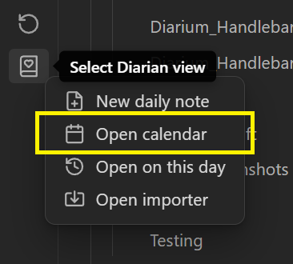
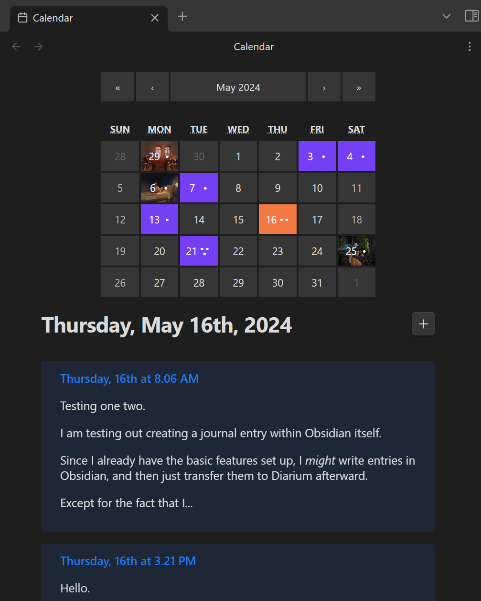
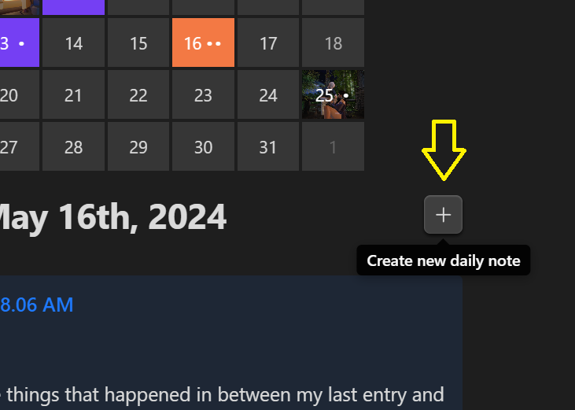
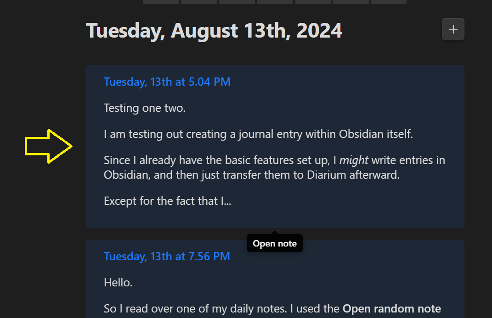
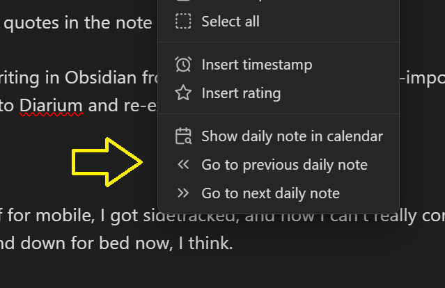

# Table of Contents
1. [About Diarian](https://erallie.github.io/diarian/index.html "https://erallie.github.io/diarian/index.html")
    1. [Features](https://erallie.github.io/diarian/index.html#features "https://erallie.github.io/diarian/index.html#features")
        1. [Included features](https://erallie.github.io/diarian/index.html#included-features "https://erallie.github.io/diarian/index.html#included-features")
        2. [Excluded features](https://erallie.github.io/diarian/index.html#excluded-features "https://erallie.github.io/diarian/index.html#excluded-features")
2. [Credits](https://erallie.github.io/diarian/Credits.html "https://erallie.github.io/diarian/Credits.html")
3. [Installation](https://erallie.github.io/diarian/Installation.html "https://erallie.github.io/diarian/Installation.html")
    1. [Use BRAT](https://erallie.github.io/diarian/Installation.html#use-brat "https://erallie.github.io/diarian/Installation.html#use-brat")
    2. [Manual installation](https://erallie.github.io/diarian/Installation.html#manual-installation "https://erallie.github.io/diarian/Installation.html#manual-installation")
4. Instructions
    1. [Calendar](https://erallie.github.io/diarian/Instructions/Calendar.html "https://erallie.github.io/diarian/Instructions/Calendar.html")
        1. [Editor navigation](https://erallie.github.io/diarian/Instructions/Calendar.html#editor-navigation "https://erallie.github.io/diarian/Instructions/Calendar.html#editor-navigation")
    2. [On this day](https://erallie.github.io/diarian/Instructions/On%20this%20day.html "https://erallie.github.io/diarian/Instructions/On%20this%20day.html")
        1. [Notifications](https://erallie.github.io/diarian/Instructions/On%20this%20day.html#notifications "https://erallie.github.io/diarian/Instructions/On%20this%20day.html#notifications")
            1. [Pop-up modals](https://erallie.github.io/diarian/Instructions/On%20this%20day.html#pop-up-modals "https://erallie.github.io/diarian/Instructions/On%20this%20day.html#pop-up-modals")
            2. [Notices](https://erallie.github.io/diarian/Instructions/On%20this%20day.html#notices "https://erallie.github.io/diarian/Instructions/On%20this%20day.html#notices")
    3. [Multiple or nested daily notes](https://erallie.github.io/diarian/Instructions/Multiple%20or%20nested%20daily%20notes.html "https://erallie.github.io/diarian/Instructions/Multiple%20or%20nested%20daily%20notes.html")
    4. [Importer](https://erallie.github.io/diarian/Instructions/Importer.html "https://erallie.github.io/diarian/Instructions/Importer.html")
        1. [Importer notes](https://erallie.github.io/diarian/Instructions/Importer.html#importer-notes "https://erallie.github.io/diarian/Instructions/Importer.html#importer-notes")
    5. [Rating](https://erallie.github.io/diarian/Instructions/Rating.html "https://erallie.github.io/diarian/Instructions/Rating.html")
        1. [Customization](https://erallie.github.io/diarian/Instructions/Rating.html#customization "https://erallie.github.io/diarian/Instructions/Rating.html#customization")
    6. [Timestamp](https://erallie.github.io/diarian/Instructions/Timestamp.html "https://erallie.github.io/diarian/Instructions/Timestamp.html")
# Calendar
Access the **Calendar** view from the context menu that opens after clicking the **ribbon icon**.

The **Calendar** view displays all your daily notes in a calendar layout.

- The number of **dots** ( • ) on a tile represents how many daily notes you have written that day.
- If you have images attached, the first image you attached that day will show up on the tile of that day.

Select the **plus button** ( <svg xmlns="http://www.w3.org/2000/svg" width="18" height="18" viewBox="0 0 24 24" fill="none" stroke="currentColor" stroke-width="1.5" stroke-linecap="round" stroke-linejoin="round" class="lucide lucide-plus"><path d="M5 12h14"/><path d="M12 5v14"/></svg> ) to create a new note on that day.

Select a note preview to open it.

## Editor navigation
You can navigate between daily notes from the editor by using the following commands (See [Command palette](https://help.obsidian.md/Plugins/Command+palette)):
- **Diarian: Show daily note in calendar**
- **Diarian: Go to previous daily note**
- **Diarian: Go to next daily note**

These commands can also be accessed from the file and editor context menus.

