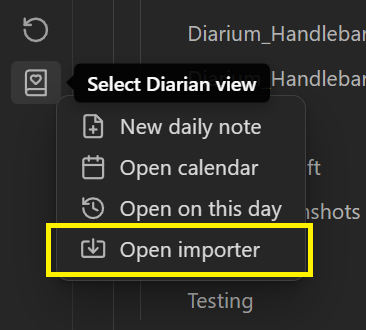

# Table of Contents
1. [About Diarian](https://erallie.github.io/diarian/index.html#about-diarian "https://erallie.github.io/diarian/index.html#about-diarian")
    1. [Features](https://erallie.github.io/diarian/index.html#features "https://erallie.github.io/diarian/index.html#features")
        1. [Included features](https://erallie.github.io/diarian/index.html#included-features "https://erallie.github.io/diarian/index.html#included-features")
        2. [Excluded features](https://erallie.github.io/diarian/index.html#excluded-features "https://erallie.github.io/diarian/index.html#excluded-features")
2. [Credits](https://erallie.github.io/diarian/Credits.html#credits "https://erallie.github.io/diarian/Credits.html#credits")
3. [Installation](https://erallie.github.io/diarian/Installation.html#installation "https://erallie.github.io/diarian/Installation.html#installation")
    1. [Use BRAT](https://erallie.github.io/diarian/Installation.html#use-brat "https://erallie.github.io/diarian/Installation.html#use-brat")
    2. [Manual installation](https://erallie.github.io/diarian/Installation.html#manual-installation "https://erallie.github.io/diarian/Installation.html#manual-installation")
4. Instructions
    1. [Calendar](https://erallie.github.io/diarian/Instructions/Calendar.html#calendar "https://erallie.github.io/diarian/Instructions/Calendar.html#calendar")
        1. [Editor navigation](https://erallie.github.io/diarian/Instructions/Calendar.html#editor-navigation "https://erallie.github.io/diarian/Instructions/Calendar.html#editor-navigation")
    2. [On this day](https://erallie.github.io/diarian/Instructions/On%20this%20day.html#on-this-day "https://erallie.github.io/diarian/Instructions/On%20this%20day.html#on-this-day")
        1. [Notifications](https://erallie.github.io/diarian/Instructions/On%20this%20day.html#notifications "https://erallie.github.io/diarian/Instructions/On%20this%20day.html#notifications")
            1. [Pop-up modals](https://erallie.github.io/diarian/Instructions/On%20this%20day.html#pop-up-modals "https://erallie.github.io/diarian/Instructions/On%20this%20day.html#pop-up-modals")
            2. [Notices](https://erallie.github.io/diarian/Instructions/On%20this%20day.html#notices "https://erallie.github.io/diarian/Instructions/On%20this%20day.html#notices")
    3. [Multiple or nested daily notes](https://erallie.github.io/diarian/Instructions/Multiple%20or%20nested%20daily%20notes.html#multiple-or-nested-daily-notes "https://erallie.github.io/diarian/Instructions/Multiple%20or%20nested%20daily%20notes.html#multiple-or-nested-daily-notes")
    4. [Importer](https://erallie.github.io/diarian/Instructions/Importer.html#importer "https://erallie.github.io/diarian/Instructions/Importer.html#importer")
        1. [Importer notes](https://erallie.github.io/diarian/Instructions/Importer.html#importer-notes "https://erallie.github.io/diarian/Instructions/Importer.html#importer-notes")
    5. [Rating](https://erallie.github.io/diarian/Instructions/Rating.html#rating "https://erallie.github.io/diarian/Instructions/Rating.html#rating")
        1. [Customization](https://erallie.github.io/diarian/Instructions/Rating.html#customization "https://erallie.github.io/diarian/Instructions/Rating.html#customization")
    6. [Timestamp](https://erallie.github.io/diarian/Instructions/Timestamp.html#timestamp "https://erallie.github.io/diarian/Instructions/Timestamp.html#timestamp")

# Importer
Access the **Importer** from the context menu that opens after clicking the **ribbon icon**.

The **Importer** allows you to import a pre-existing journal from [Diarium](https://diariumapp.com/):
1. Follow the instructions onscreen to export your [Diarium](https://diariumapp.com/) journal to your local files.
2. After they've been exported, choose the exported zip file, and then select **Import**.

## Importer notes
- Entries will be imported to the location specified under **Settings → Daily notes**.
	- If you have multiple entries per day, follow the instructions under [Multiple or nested daily notes](./Multiple%20or%20nested%20daily%20notes.md) before importing your journal.
- Attachments will be uploaded to the location specified under **Settings → Files and links → Default location for new attachments**.
- Properties will be populated according to the data exported from [Diarium](https://diariumapp.com/).
	- The **rating** property name can be set under **Settings → Diarian → Rating → Property name**.
	- If [Map View](https://obsidian.md/plugins?id=obsidian-map-view) is installed, the **location** property will use the name set under **Settings → Map View → Settings for the map view plugin. → Key for front matter location**.
	- Each tracker exported from [Diarium](https://diariumapp.com/) will be imported as an individual property.
	- If **How to handle duplicate notes** is set to **Append all new entries**, any existing properties from the new entry will be inserted inside a code block at the beginning of the appended content.
		- I am currently planning to add options to change this behavior in the near future.
