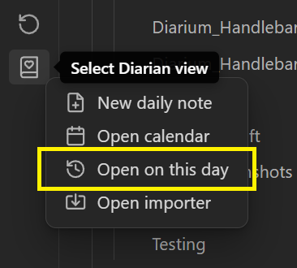
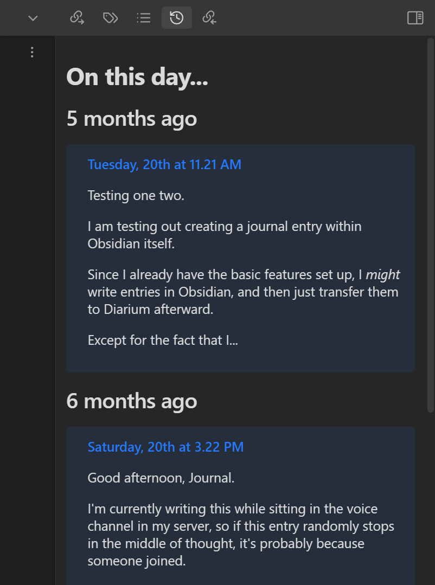
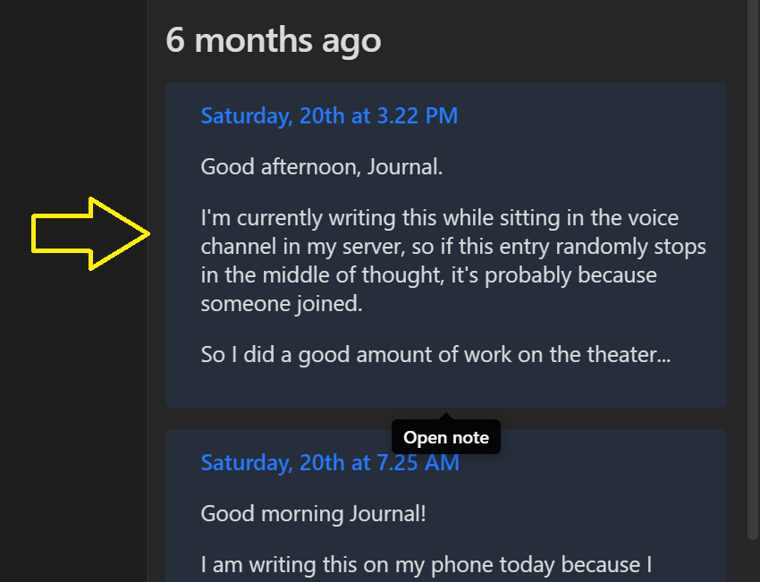
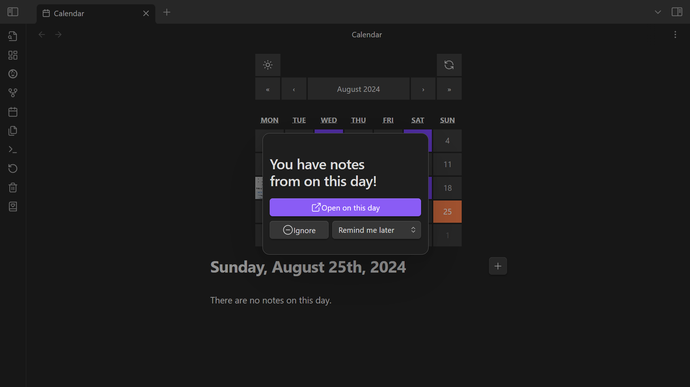
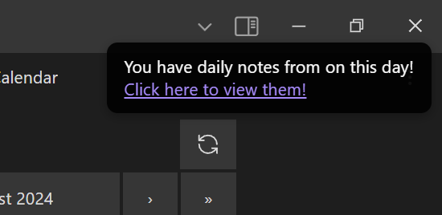

# Table of Contents

# On this day
Access the **On this day** view from the context menu that opens after clicking the **ribbon icon**.

The **On this day** view displays notes written on previous days.

The interval between days to review (eg. every 3 months) and how long ago to start including notes (eg. 6 months ago or earlier) can be adjusted under **Settings → Diarian → On this day**.

Select a note preview to open it.

## Notifications
You can optionally receive a notification when there are daily notes from **On this day** to review.

To enable notifications, set **Settings → Diarian → On this day → Notifications** to either **Pop-up modal** or **Notice**.
### Pop-up modals
Pop-up notifications will appear as a modal when you first open your vault.

If dismissed by selecting **Open on this day** or **Ignore**, pop-up notifications will not appear again that day.

If **Remind me later** is selected, the notification will appear again after the chosen duration when your vault is open.
### Notices
Notice notifications will appear when you first open your vault.

Notices will remain onscreen until selected.
- Select the link to open the **On this day** view.
- Click or tap elsewhere on the notice to dismiss the notice.
