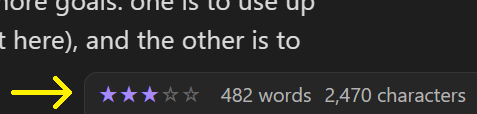
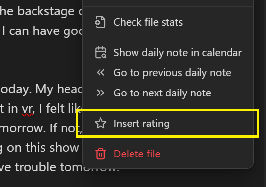
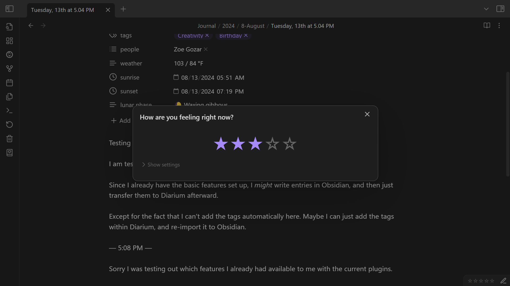
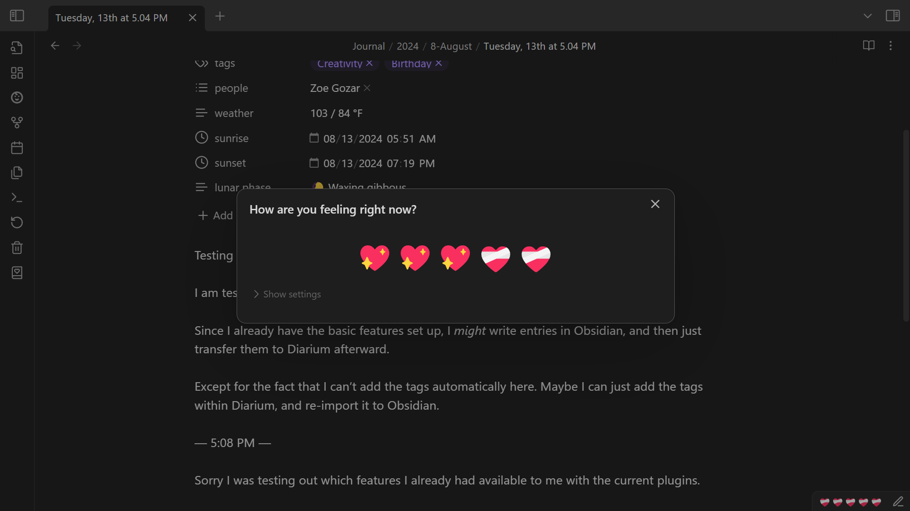
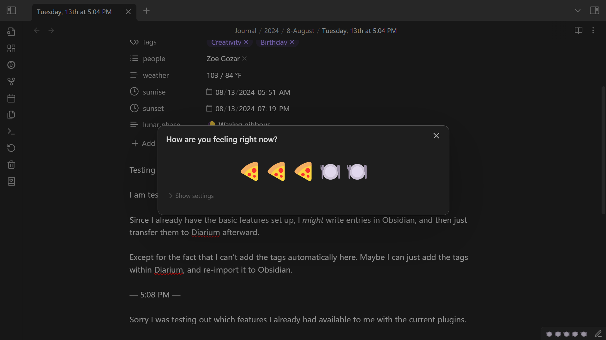

# Table of Contents
1. [Home](../../../../enveloppe/Plugins%20&%20Themes/Diarian/Wiki/Home/About%20Diarian.md)
	1. [About Diarian](../../../../enveloppe/Plugins%20&%20Themes/Diarian/Wiki/Home/About%20Diarian.md)
	2. [Features](../../../../enveloppe/Plugins%20&%20Themes/Diarian/Wiki/Home/About%20Diarian.md#Features)
		1. [Included features](../../../../enveloppe/Plugins%20&%20Themes/Diarian/Wiki/Home/About%20Diarian.md#Included%20features)
		1. [Excluded features](../../../../enveloppe/Plugins%20&%20Themes/Diarian/Wiki/Home/About%20Diarian.md#Excluded%20features)
3. Instructions
	1. [Calendar](../Instructions/Calendar.md)
		1. [Editor navigation](Instructions/Calendar.md#Editor%20navigation)
	2. [On this day](../Instructions/On%20this%20day.md)
		1. [Notifications](../Instructions/On%20this%20day.md#Notifications)
			1. [Pop-up modals](../Instructions/On%20this%20day.md#Pop-up%20modals)
			2. [Notices](../Instructions/On%20this%20day.md#Notices)
	3. [Importer](../Instructions/Importer.md)
		1. [Importer notes](../Instructions/Importer.md#Importer%20notes)
	4. [Rating](../Instructions/Rating.md)
		1. [Customization](../Instructions/Rating.md#Customization)
	5. [Timestamp](../Instructions/Timestamp.md)
	6. [Multiple or nested daily notes](../Instructions/Multiple%20or%20nested%20daily%20notes.md)
4. [Installation](../Installation.md)
	1. [Use BRAT](../Installation.md#Use%20BRAT)
	2. [Manual installation](../Installation.md#Manual%20installation)
5. [Credits](../Credits.md)

# Rating
A rating will appear in the status bar whenever you're viewing a daily note.

The status bar reads the note properties to determine the rating. If no rating has been set, the status bar will display an empty rating.

To set a rating, do one of the following things:
- Click the rating in the status bar (on desktop).
- Perform the **Diarian: Insert rating** command (See [Command palette](https://help.obsidian.md/Plugins/Command+palette)).
- Select **Insert rating** from the file context menu or the editor context menu.
    

A modal will then open that will allow you to set the rating as you like.

## Customization
Under **Settings → Diarian → Rating**, you can set the **Filled rating item** and the **Empty rating item** to any Unicode character or emoji you like.

For example, here are some hearts:

And here is some food:

