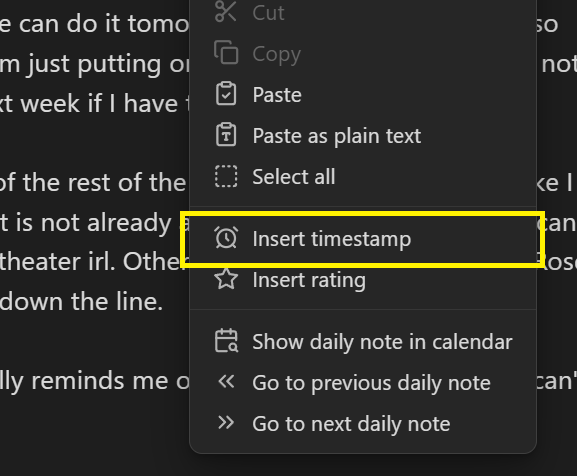

# Timestamp
To insert a timestamp, do one of the following:
- Perform the **Diarian: Insert timestamp** command (See [Command palette](https://help.obsidian.md/Plugins/Command+palette)).
- Select **Insert timestamp** from the editor context menu.
    

If the active note is from the current day, only the time will be inserted in the timestamp. Otherwise, both the date and the time will be inserted.