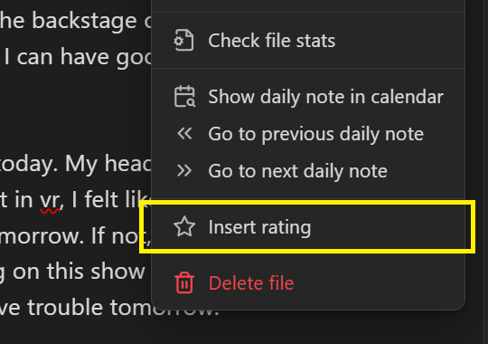
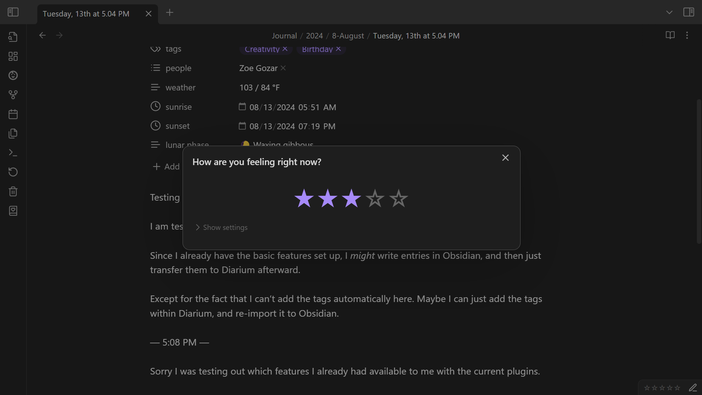

# Rating
A rating will appear in the status bar whenever you're viewing a daily note.

The status bar reads the note properties to determine the rating. If no rating has been set, the status bar will display an empty rating.

To set a rating, do one of the following things:
- Click the rating in the status bar (on desktop).
- Perform the **Diarian: Insert rating** command (See [Command palette](https://help.obsidian.md/Plugins/Command+palette)).
- Select **Insert rating** from the file context menu or the editor context menu.
    

A modal will then open that will allow you to set the rating as you like.

## Customization
Under **Settings → Diarian → Rating**, you can set the **Filled rating item** and the **Empty rating item** to any Unicode character or emoji you like.

For example, here are some hearts:

And here is some food:

